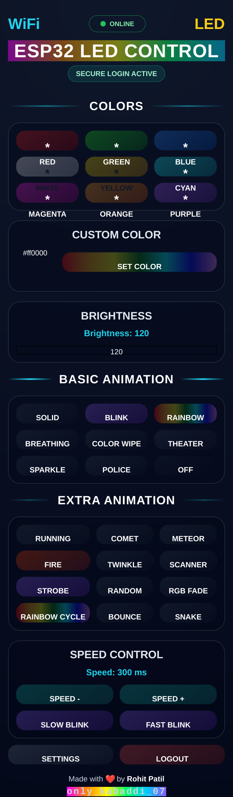

# ESP32 WS2812 Web LED Controller V1

A local Wi-Fi based ESP32 LED controller for WS2812 RGB LEDs using a webpage interface.

## Webpage UI



## Features

- ESP32 local webserver
- Webpage based LED control
- RGB color control
- Brightness control
- Animation modes
- Speed control
- OTA wireless update support
- Wi-Fi setup page
- Custom login page
- Online/offline status
- Push button mode control
- Long-press factory reset

## Hardware Used

- ESP-WROOM-32 / ESP32 DevKit
- WS2812 RGB LED module or strip
- Push button
- 330 ohm resistor for LED data line
- 10k pulldown resistor for LED data line
- 5V power supply

## Pin Connection

| ESP32 Pin | Connection |
|---|---|
| GPIO27 | WS2812 DIN |
| VIN / 5V | WS2812 VCC |
| GND | WS2812 GND |
| GPIO25 | Push Button |
| GND | Push Button |

## Project Description

## Important Note

This project is designed for local Wi-Fi network use.
The ESP32 hosts a local HTTP webpage, so it should not be directly exposed to the public internet using router port forwarding.

For remote control, use a secure IoT platform such as Blynk, MQTT cloud, VPN, Home Assistant, or ESP RainMaker.

## Author

**Rohit Patil**

Embedded Software Developer | IoT & ESP32 Projects

GitHub: [Rohitpatil0707-rohii](https://github.com/Rohitpatil0707-rohii)


The project is useful for learning ESP32 Wi-Fi, embedded webserver design, OTA update, persistent storage, and IoT-style device control.

## Default Setup Mode

When Wi-Fi is not configured, ESP32 starts setup mode.

```text
SSID: ESP32_LED_SETUP
Page: 192.168.4.1
