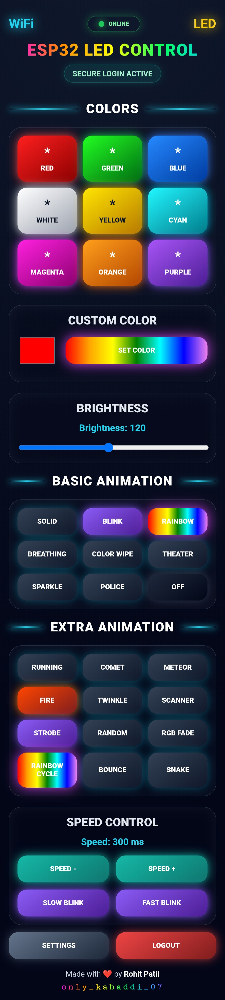
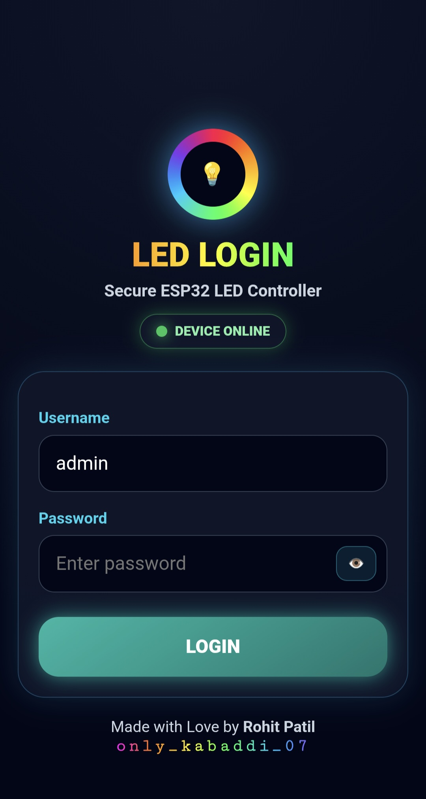

# ESP32 WS2812 Web LED Controller V.1

A local Wi-Fi based ESP32 LED controller for WS2812 RGB LEDs using a responsive webpage interface.

This project is built using **ESP-WROOM-32 / ESP32 DevKit** and **WS2812 addressable RGB LEDs**. The ESP32 hosts a local webserver, allowing a mobile phone or laptop on the same Wi-Fi network to control LED colors, brightness, animation modes, speed, settings, login, OTA update, and factory reset.

---

## Webpage UI



## Login Page UI



---

## Features

* ESP32 local webserver
* Webpage-based LED control
* RGB color control
* Custom color picker
* Brightness control
* Multiple animation modes
* Speed control
* OTA wireless update support
* Wi-Fi setup page
* Custom login page
* Online/offline device status
* Push button mode control
* Long-press factory reset
* Persistent storage using ESP32 Preferences
* Mobile-friendly responsive UI

---

## Hardware Used

* ESP-WROOM-32 / ESP32 DevKit
* WS2812 RGB LED module or strip
* Push button
* 330Ω resistor for LED data line
* 10kΩ pulldown resistor for LED data line
* 5V power supply

---

## Pin Connection

| ESP32 Pin | Connection  |
| --------- | ----------- |
| GPIO27    | WS2812 DIN  |
| VIN / 5V  | WS2812 VCC  |
| GND       | WS2812 GND  |
| GPIO25    | Push Button |
| GND       | Push Button |

---

## Circuit Notes

For stable WS2812 LED operation:

* Connect ESP32 GND and LED power supply GND together.
* Use a 330Ω resistor between ESP32 GPIO27 and WS2812 DIN.
* Use a 10kΩ pulldown resistor from WS2812 DIN to GND.
* Use an external 5V supply if using more LEDs.
* Do not power a large LED strip directly from the ESP32 board.

---

## Project Description

This project uses the ESP32 as a local Wi-Fi webserver. After connecting to the same Wi-Fi network, the user can open the ESP32 IP address or mDNS name in a browser and control the WS2812 LED from a webpage.

The project is useful for learning:

* ESP32 Wi-Fi programming
* Embedded webserver development
* HTML, CSS, and JavaScript UI for embedded devices
* OTA firmware update
* Persistent storage
* GPIO input handling
* WS2812 LED control
* IoT-style local device control

---

## Supported LED Controls

### Color Controls

* Red
* Green
* Blue
* White
* Yellow
* Cyan
* Magenta
* Orange
* Purple
* Custom color picker

### Basic Animation Modes

* Solid
* Blink
* Rainbow
* Breathing
* Color Wipe
* Theater
* Sparkle
* Police
* Off

### Extra Animation Modes

* Running
* Comet
* Meteor
* Fire
* Twinkle
* Scanner
* Strobe
* Random Color
* RGB Fade
* Rainbow Cycle
* Color Bounce
* Snake

### Other Controls

* Brightness control
* Speed control
* Slow blink
* Fast blink
* Settings page
* Logout

---

## Default Setup Mode

When Wi-Fi is not configured, the ESP32 starts in setup mode.

Connect your phone or laptop to the ESP32 setup hotspot and open the setup page.

```text
SSID: ESP32_LED_SETUP
Page: 192.168.4.1
```

The Wi-Fi credentials, admin login, OTA password, and device settings can be configured from the setup/settings page.

---

## Push Button Function

The push button is connected to GPIO25.

### Short Press

Changes LED mode manually.

Example cycle:

```text
OFF → SOLID → BLINK → RAINBOW → OFF
```

### Long Press

Long press is used for factory reset.

It clears saved configuration and restarts the ESP32.

---

## OTA Update

This project supports OTA wireless firmware updates.

After the ESP32 is connected to Wi-Fi, firmware can be uploaded wirelessly from Arduino IDE using the ESP32 network port.

Use USB upload first, then OTA can be used for future updates.

---

## Required Arduino Libraries

Install these libraries in Arduino IDE:

* Adafruit NeoPixel
* ESP32 board package
* Preferences library
* WiFi library
* WebServer library
* ArduinoOTA library

Most ESP32 libraries come with the ESP32 board package.

---

## Arduino IDE Board Settings

Recommended settings:

```text
Board: ESP32 Dev Module
Upload Speed: 921600 or 115200
CPU Frequency: 240 MHz
Flash Frequency: 80 MHz
Partition Scheme: Default
Port: Your ESP32 COM Port
```

---

## Project File Structure

```text
ESP32_WS2812_Web_Controller_V1/
│
├── ESP32_WS2812_Web_Controller_V1.ino
├── LED.h
├── LED.cpp
├── Webpage.h
├── MY_OTA.h
├── MY_OTA.cpp
├── Storage.h
├── Storage.cpp
├── Config.h
├── Config.cpp
├── ConfigPage.h
├── Auth.h
├── Auth.cpp
├── LoginPage.h
├── README.md
└── Images/
    ├── webpage-ui.png
    └── login-page.png
```

---

## How to Upload Code

1. Open the project folder in Arduino IDE.
2. Open `ESP32_WS2812_Web_Controller_V1.ino`.
3. Select the correct ESP32 board.
4. Select the correct COM port.
5. Click Upload.
6. Open Serial Monitor at 115200 baud.
7. Connect to the ESP32 setup Wi-Fi if required.
8. Configure Wi-Fi and login settings.
9. Open the ESP32 IP address in a browser.

---

## Important Note

This project is designed for local Wi-Fi network use.

The ESP32 hosts a local HTTP webpage, so it should not be directly exposed to the public internet using router port forwarding.

For secure remote control, use a proper IoT platform or secure network method such as:

* Blynk
* MQTT cloud
* VPN
* Home Assistant
* ESP RainMaker

---

## GitHub Repository

```text
https://github.com/Rohitpatil0707-rohii/ESP32-WS2812-Web-Controller-V1
```

---

## Author

**Rohit Patil**

Embedded Software Developer | IoT & ESP32 Projects

GitHub: [Rohitpatil0707-rohii](https://github.com/Rohitpatil0707-rohii)

---

## License

This project is open source and can be used for learning and development purposes.
